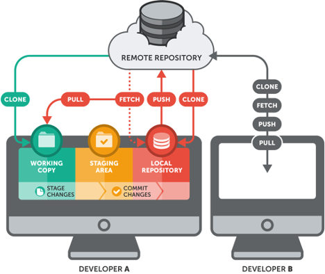

# GIX Git Demo
Demo repository for TECHIN514

This lab is designed to become familar with github and conda.  

Github is the tool for sharing code and working on projects together.  Its also sometimes important to manage dependencies so that everyone is running from the same set of libraries.

We can do this with package managers or with python virtual environments. conda is a popular package manager that makes it easy to manage a list of library dependencies that might need to be installed. There are other options too of course, but conda is pretty good.

Image from git-tower.com/learn/git/ebook/en/command-line/remote-repositories

So for this lab... 

Install github and miniconda

Follow the instructions provided in the lecture presentation. While testing, If entering your password during git push doesn't work check the below link for PAT:

https://docs.github.com/en/authentication/keeping-your-account-and-data-secure/creating-a-personal-access-token

You will be able to perform basic git operations with this information.

Now clone this repository (GIXDemo) onto your computer.

it includes a conda environment yaml that you'll need to activate.

from the respository, create a new conda environment from GIX514Demo.yaml

conda env create --file GIX514Demo.yaml

and activate the new environment using

conda activate GIX514Demo

and run the python script GIX_envtest.py

You should see the version numbers for python and the installed numpy package. Record these for your answer.... 

Now let's do the same for someone else and setup an environment to share! (Also can be done in same system but in a different directory)

create a new public repository, name it TECHIN514-xxxxx where xxxxx is whatever you think is a good name copy the file env-test.py from this repo into your new repository. (You can test commit and push your local repo to a remote repo here)

As a task, You'll also need numpy installed, and we'll specify a specific version, and do to that we'll use conda.

Let's say for exmaple we need a specific version of numpy to be compatible with our code e.g. 1.19.2 (even though the current version might be 1.21)

create a new conda environment called GIX514Assignment that includes numpy 1.19.2

(conda create --name GIX514Assignment python=3.8 numpy=1.19.2)

To test this, open python and note the current version.  and the version of the numpy library.  On my computer for example... 

Python 2.7.18 (default, Nov 13 2021, 06:17:34)
[GCC Apple LLVM 13.0.0 (clang-1300.0.29.10) [+internal-os, ptrauth-isa=deployme on darwin
Type "help", "copyright", "credits" or "license" for more information.
>>> import numpy as np
>>> print(np.__version)
1.8.0rc1
>>>

Then check the list of available environments 

(conda env list)

Then activate the new conda environment GIX514Assignment

(conda activate GIX514Assignment)

you'll see the prompt change to show the active environment.  now repeat the same steps and note your python and numpy version.

(GIX514Assignment) blah@blahblah ~ % python
Python 3.8.11 (default, Aug 16 2021, 12:04:33)
[Clang 12.0.0 ] :: Anaconda, Inc. on darwin
Type "help", "copyright", "credits" or "license" for more information.
>>> import numpy as np
>>> print (np.__version__)
1.19.2

Pretty cool!  we've specified our environment exactly.
Now export your environemnt so you can share it with someone else.

conda env export --name GIX514Assignment > GIX514Assignment.yaml

Resources:
This is a good cheat sheet for conda https://docs.conda.io/projects/conda/en/latest/_downloads/843d9e0198f2a193a3484886fa28163c/conda-cheatsheet.pdf

